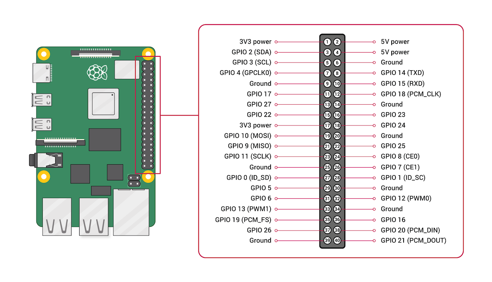
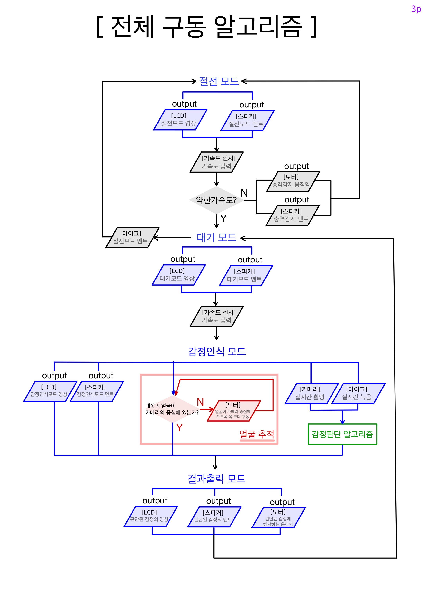

# **E-ro: 감정인식 로봇 🤖**  
**E-ro: Emotional Recognition Robot**

**E-ro**는 사람의 감정을 인식하고 상호작용할 수 있는 감정인식 로봇으로, **2023 창의적 종합설계 컨소시엄** 프로젝트의 일환으로 개발되었습니다. 이 로봇은 **메라비언의 법칙**(표정 55%, 음색 38%, 단어 7%)을 기반으로 감정을 분석하며, **카메라**, **음성 분석**, **문장 분석** 기술을 결합해 정밀한 감정 인식을 제공합니다.  
**E-ro** is an emotional recognition robot designed to recognize and interact with human emotions. Developed as part of the **2023 Creative Comprehensive Design Consortium**, this robot uses **Mehrabian's Rule** (55% facial expression, 38% tone, 7% words) to analyze emotions by combining facial, vocal, and text-based sentiment analysis.

---

## **프로젝트 개요 / Project Overview**

E-ro는 다음과 같은 기술과 접근 방식을 사용합니다:  
E-ro utilizes the following technologies and approaches:

- **표정 분석 (Facial Analysis)**: 28,709개의 얼굴 데이터를 머신러닝으로 학습한 감정 인식 모델을 사용하여 얼굴 표정을 분석합니다.  
  **Emotion recognition using facial expressions** trained on 28,709 facial datasets using machine learning.

- **음색 분석 (Vocal Tone Analysis)**: 28명의 화자로부터 2,000개의 오디오 데이터를 학습한 모델로 음성을 분석합니다.  
  **Speech tone analysis using audio data** trained from 28 speakers (2,000 audio files).

- **문장 분석 (Sentence Analysis)**: Google Speech-to-Text(STT)와 Text-to-Speech(TTS) API를 활용하여 문장의 감정을 인식합니다.  
  **Text-based emotion recognition** using Google Speech-to-Text (STT) and Text-to-Speech (TTS) APIs.

- **메라비언의 법칙 (Mehrabian's Rule)**: 표정(55%), 음색(38%), 단어(7%)의 가중치를 기반으로 최종 감정을 판단합니다.  
  **Emotion judgment based on Mehrabian's Rule**: Combining facial expressions (55%), vocal tone (38%), and words (7%).

---

## **주요 기능 / Key Features**

### 1. **표정 감정 인식 / Facial Emotion Recognition**
- **모델 출처 / Model Source**: [Emotion Recognition by omar-aymen](https://github.com/omar-aymen/Emotion-recognition)  
- **동작 방식 / Functionality**:
  - 얼굴을 실시간으로 추적하며 감정을 분석합니다.  
    Real-time tracking and analysis of facial expressions.
  - 감정 값이 40 이상인 상태가 2초 이상 유지될 경우 유효 데이터로 판단합니다.  
    If an emotion score remains above 40 for more than 2 seconds, it is considered valid.

### 2. **얼굴 추적 / Facial Tracking**
- **모델 출처 / Model Source**: [Face Tracking with Raspberry Pi](https://core-electronics.com.au/guides/Face-Tracking-Raspberry-Pi/#Open)  
- **기능 / Features**:
  - 실시간으로 얼굴의 위치를 추적하고 카메라의 방향을 조정합니다.  
    Tracks the position of the face in real time and adjusts the camera's direction.

### 3. **음색 감정 인식 / Vocal Tone Analysis**
- **모델 출처 / Model Source**: [Speech Emotion Analyzer by MiteshPuthran](https://github.com/MiteshPuthran/Speech-Emotion-Analyzer)  
- **기능 / Features**:
  - 음성의 억양, 속도, 음높이를 기반으로 감정을 분석합니다.  
    Analyzes tone, speed, and pitch of the voice to determine emotion.
  - 사용자의 음성 데이터를 실시간으로 처리합니다.  
    Processes user speech data in real time.

### 4. **문장 감정 인식 / Sentence Emotion Recognition**
- **API 출처 / API Source**: Google Speech-to-Text 및 Text-to-Speech API  
- **기능 / Features**:
  - 문장에서 감정 판단의 기준이 되는 단어와 부정어 조합을 분석합니다.  
    Identifies emotional cues and negations in sentences to determine emotion.
  - 텍스트 분석으로 긍정, 부정, 중립 감정을 판단합니다.  
    Determines positive, negative, or neutral sentiments using text analysis.

### 5. **메라비언의 법칙 기반 감정 판단 / Emotion Judgment via Mehrabian's Rule**
- 표정(55%), 음색(38%), 단어(7%) 가중치를 기반으로 최종 감정을 판단합니다.  
  Final emotion is determined by applying weights: facial expressions (55%), vocal tone (38%), and words (7%).

---

## **시스템 요구사항 / System Requirements**

### **하드웨어 / Hardware**
- **Raspberry Pi 4** or similar microcontroller  
- **Camera module** (for facial emotion recognition and tracking)  
- **Microphone** (for voice input)  
- **Speaker** (for voice output)  
- **Servo motors** (for motion control)  
- Additional: Touch sensor (for tactile interaction)  

### **소프트웨어 / Software**
- **Python 3.8 이상 / Python 3.8+**  
- 필수 라이브러리 / Required Libraries:
  - **OpenCV**: 얼굴 감지 및 이미지 처리 / Facial detection and image processing
  - **TensorFlow**: 감정 분석 모델 / Emotion analysis model
  - **SpeechRecognition**: 음성 인식 / Speech recognition
  - **librosa**: 음성 신호 분석 / Speech signal processing
  - **Google Cloud Speech & TTS API** 설정 필요 / Requires Google Cloud Speech & TTS API setup

---

## **GPIO pin diagram**

## **Algorithm**

---

## **컨소시엄**

### 본 프로젝트는 산업통상자원부가 주최하는 '2023년 창의적 종합설계 경진대회'에서 '공학혁신상'을 수상하였습니다.
